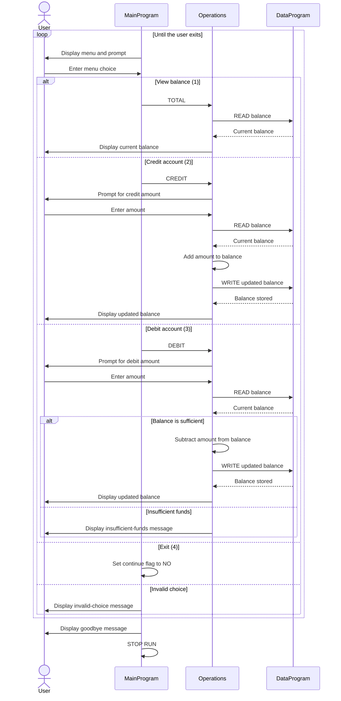

# Student Account Management System

## Purpose

This COBOL sample provides a console menu for viewing and changing a single student account balance. The account is held in memory for the duration of the program; the sample does not load or save account data to an external system.

## COBOL Files

| File | Purpose | Key logic |
| --- | --- | --- |
| `src/cobol/main.cob` | Console entry point and menu loop. | Displays the account options, accepts a choice, and calls `Operations` to view the balance, credit the account, or debit it. Choice 4 exits; other choices display an error. |
| `src/cobol/operations.cob` | Handles account operations and user interaction for amounts. | Reads and displays the balance for `TOTAL`; prompts for an amount, updates the balance, and displays the result for `CREDIT`; checks available funds before processing `DEBIT`. |
| `src/cobol/data.cob` | Stores and retrieves the current balance. | `READ` copies the stored balance to the caller; `WRITE` copies the caller's balance into storage. The stored balance is initialized to 1000.00. |

## Account Business Rules

- The single account starts with a balance of **1000.00**.
- A credit adds the entered amount to the current balance.
- A debit is processed only when the current balance is greater than or equal to the requested amount. A debit equal to the full balance is allowed; a larger debit is rejected with an insufficient-funds message and does not change the balance.
- The program operates on one in-memory balance. It does not identify individual students, manage multiple accounts, or persist changes after the process ends.
- The code does not define additional validation rules for entered amounts, such as a positive-only check or explicit range/error handling.

## Operation Flow

`MainProgram` dispatches menu selections to `Operations`. `Operations` uses `DataProgram` to read the current balance before displaying or changing it, and writes the new balance after a successful credit or debit.

## Sequence Diagram

